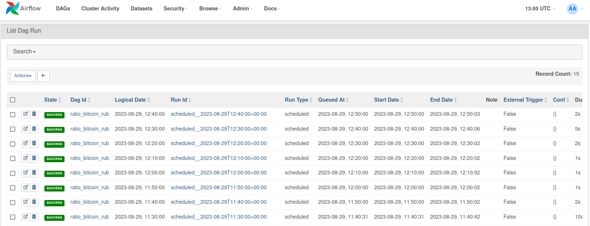
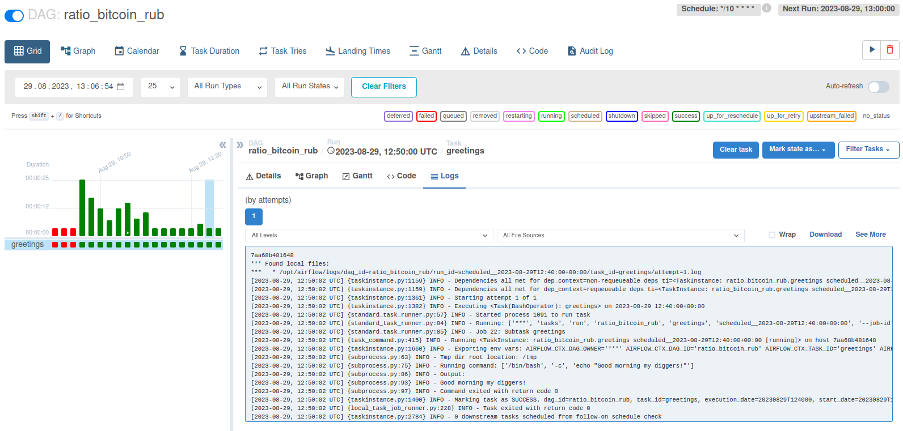
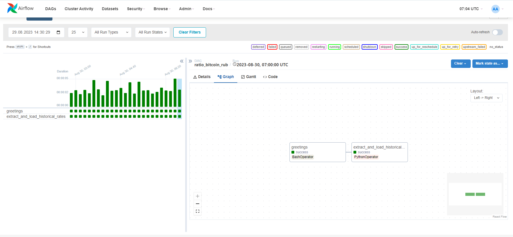
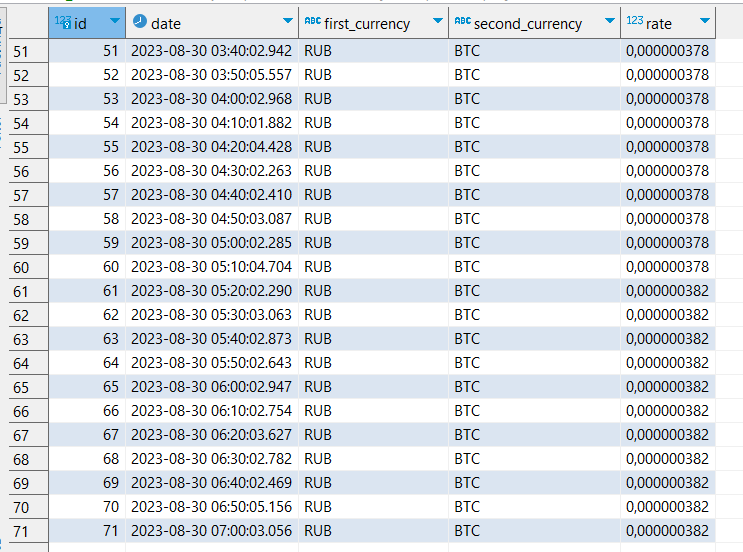

# Ratio-of-bitcoin-to-ruble-for-month

Данный проект получает курс BTC к RUB на заданные даты, затем создаёт таблицу в базе данных и вставляет туда все полученные значения.
После создаётся таблица, куда вставляются полученные значения, а именно:
- день, в который значение курса было максимальным
- день, в который значение курса было минимальным
- максимальное значение курса
- минимальное значение курса
- среднее значение курса за весь месяц
- значение курса на последний день месяца
- первая валюта
- вторая валюта
- номер месяца, за которых производились расчёты


Для запуска необходимо: 
- Запустить postgres (или через docker-compose, или другим удобным способом)
- Создать виртуальное окружение и установить все необходимые библиотеки с помощью `pip install -r requirements.txt`
- Запустить скрипт [script.py](./script.py)


## Запуск в Airflow

Для начала необходимо перейти в папку [airflow](./airflow/) (`cd airflow`). По желанию можно изменить `AIRFLOW_UID` в файле `.env` на любое другое число.

Инициализация airflow и запуск выполняется при помощи команд:
```
# При использовании Linux систем может потребоваться выполнять эти команды, добавляя в начало `sudo`

docker compose up airflow-init
docker compose up
```

Веб-сервер после этого будет доступен по адресу http://localhost:8080/

Нужно активировать DAG ratio_bitcoin_rub и после каждые 10 минут будет выводиться в вывод приветствие с помощью BashOperator






Tакже каждые 10 минут вытягиваются данные с `https://api.exchangerate.host/{конкретная_дата}` и заносятся в таблицу `historical_rates` базы данных сервиса db



